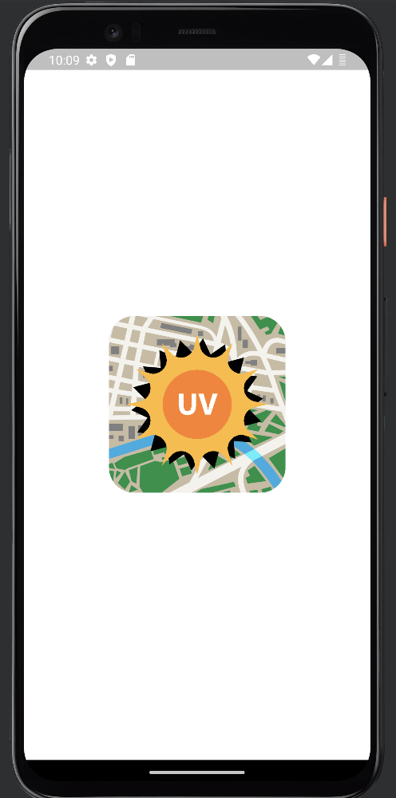
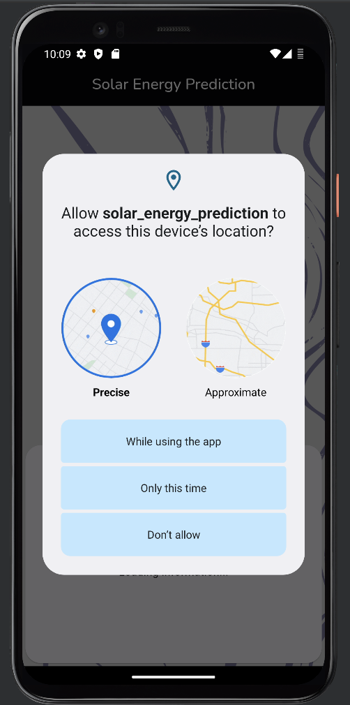
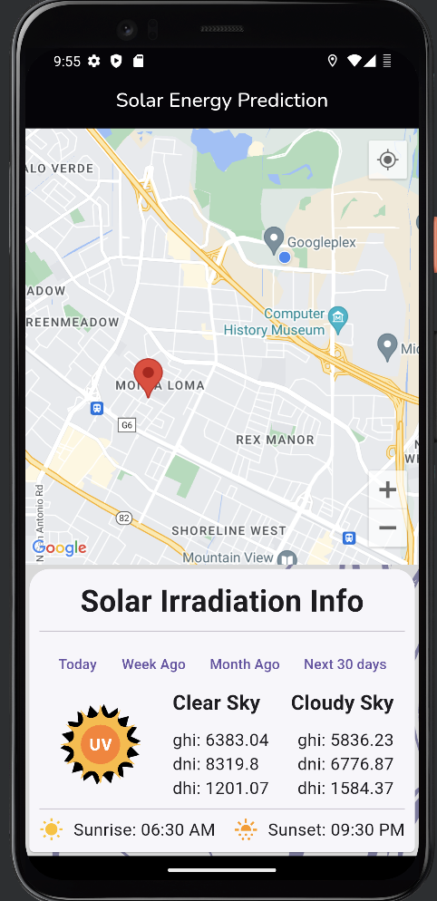
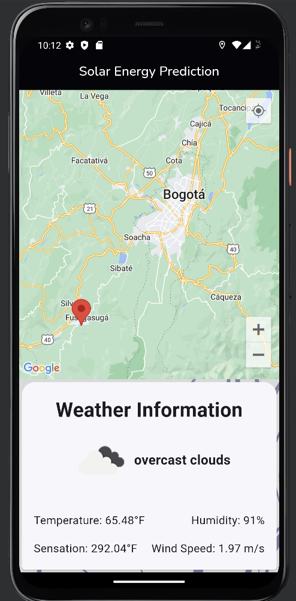
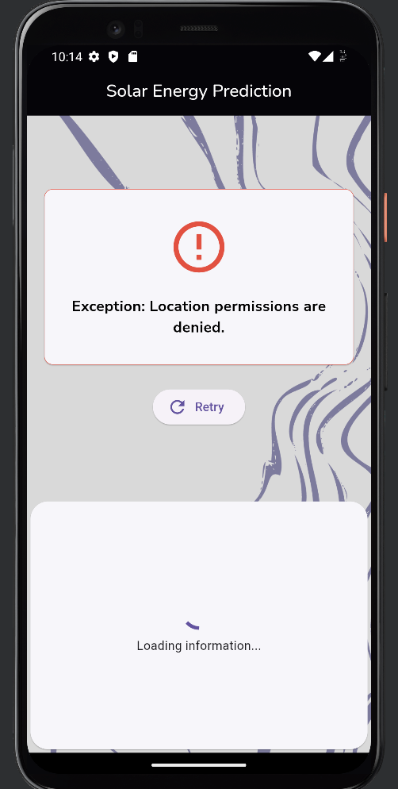

# Solar Energy Prediction

In this application you can consult the solar irradiation or the weather in your area, also by means of a map select a specific location and consult the same data.

Note: by default the weather query is selected, if you want to query the solar irradiation data you can put the open weather API KEY with the premium account accesses in the .env file just in the API_KEY_OPEN_WEATHER_IRRADIATION variable.

## Installation

### Prerequisites

Before proceeding, make sure you have installed:

- Make sure you have Flutter and Dart installed on your system. You can follow the [official Flutter documentation](https://flutter.dev/docs/get-started/install) for detailed instructions on how to do this.
- Code editor (e.g. Visual Studio Code, Android Studio, etc.)
- Make sure you have and set up a mobile device emulator in your IDE in which you can test the application.
### Installation steps

1. Clone this repository on your local machine:

````bash
git clone https://github.com/Sebastian1808/solar-energy-prediction.git
````
2. Open the directory where you cloned your project in the IDE of your choice, we recommend (Android Studio).
3. Make sure you have the Flutter and Dart SDKs installed on your system. You can follow the [official Flutter documentation](https://flutter.dev/docs/get-started/install) for detailed instructions on how to do this.
4. Configure the Device Manager in your IDE if necessary create a device to emulate the application
5. Make sure you have the .env file in the root of the project, if you don't have it create one with the .env.example structure.
6. Open a terminal at the root of the project and run the following command to obtain the necessary dependencies:

````bash
flutter pub get
````
7. Run the application with the following command:

````bash
flutter run
````
8. Enjoy the application
## Usage

1. When you run the application, it will ask for permissions to access your location, these permissions are absolutely necessary for the correct functioning of the application. 

2. Once the permissions are accepted you will be able to see your location and get the weather data of your area, if you have permissions to consult solar radiation through Open Weather you can include the API KEY and consult the radiation data in your area.

3. You can also consult the same information of the place that you want by means of a map with which you can interact.

4. Enjoy the application

## Screenshots

### Splash Screen.


### Permissions Screen.


### Dashboard Screen (Solar Irradiation).


### Dashboard Screen (Weather).


### Error Screen.



## Contributing

If you want to contribute to this project and make it better, your help is very welcome. Create a pull request with your new features, bug fixes, etc.
